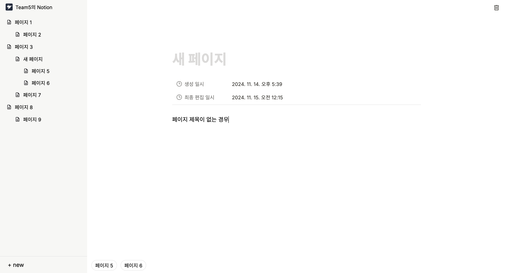

# VanillaJS_NotionCloning

### 🏆 프로젝트 개요  
**VanillaJS_NotionCloning**은 Vanilla JavaScript를 활용해 Notion의 페이지 에디터 및 문서 아카이빙 기능을 클론한 프로젝트입니다.

- **팀 이름**: TEAM5  
- **팀원**: 김동찬, 김세빈, 안민하, 우정완, 허정민  
- **기간**: 2024년 11월 11일 (월) ~ 11월 14일 (목)  

---

## 📌 프로젝트 목적  
1. **노션의 페이지 에디터와 문서 아카이빙 기능 구현**  
   - 사용자 경험을 중심으로 노션의 핵심 기능을 재현합니다.  
2. **팀원 전원이 모든 과정에 참여 및 학습**  
   - 팀원의 성장과 협업 역량 강화를 목표로 한 프로젝트입니다.  

---

## 🚀 구현 방법  

### 1. 기획  
- **기획서 작성**  
  - 일정 계획, 필요한 기능의 명세, 참고할 레퍼런스를 포함한 상세 기획서 작성  
- **와이어프레임**  
  - 기능 명세를 시각적으로 정리한 와이어프레임 제작  

### 2. 개발  
- **Vanilla JavaScript**를 활용한 SPA(Single Page Application) 구현  
  - `History API`를 사용하여 동적인 라우팅 구현  
- **HTML/CSS 성능 및 SEO 최적화**  
  - Semantic 태그를 사용하여 웹 접근성과 SEO를 강화  
- **UI/UX 개선**  
  - 문서 삭제 시 `alert` 창 제공  
  - 하위 문서 탐색을 위한 직관적인 네비게이션 구성  
- **효율적인 API 사용**  
  - 문서 자동 저장 시 `debounce` 구현으로 서버 통신 최소화

### 3. 협업  
- **소통 도구**: Notion, Slack, Figma를 활용한 원활한 팀 커뮤니케이션  
- **버전 관리**: GitHub를 통한 협업 및 코드 관리  
- **공동 작업 도구**: Figma와 Google Slides로 기획 및 결과물 정리  
- **팀원 개별 코드 리뷰**: 리뷰를 통해 코드 품질 및 이해도 향상  
- **QA**: 결과물의 최종 품질 확인을 위한 철저한 테스트  

---

## 🛠️ 기술 스택 및 도구  
- **언어 및 프레임워크**: Vanilla JavaScript, HTML, CSS  
- **프로젝트 관리**: GitHub, Slack, Notion  
- **디자인 도구**: Figma, Google Slides  

---

## 🎯 결과물 및 학습  
Notion의 핵심 기능을 성공적으로 구현했으며, 개발 과정에서 협업 능력과 다양한 기술을 익혔습니다.  

